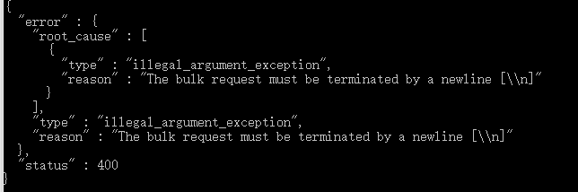

为当地址 https://www.elastic.co/guide/en/elasticsearch/reference/current/getting-started-index.html
ElasticSearch _bulk批量处理报错The bulk request must be terminated by a newline

注意 json 文件最后需要换行

或者 按照如下 批量导入

### 批量导入数据
``
POST /bank/_bulk
{"index":{"_id":"1"}}
{"account_number":1,"balance":39225,"firstname":"Amber","lastname":"Duke","age":32,"gender":"M","address":"880 Holmes Lane","employer":"Pyrami","email":"amberduke@pyrami.com","city":"Brogan","state":"IL"}
{"index":{"_id":"6"}}
``

### 查询数据
<b>match_all</b> 
查询所有数据
 

``
GET /bank/_search
{
  "query":{"match_all":{}},
  "sort":[
      {"account_number":"desc"}
    ]
}
``

<b>match</b> 
这个是单个字符串的匹配，如：查询 address 包含 ``mill`` 或 ``lane`` 的记录
 
``
GET /bank/_search
{
  "query": { "match": { "address": "mill lane" } }
}
``

<b>match_phrase</b> 
整个短语的匹配，如：查询 address 包含 ``mill lane`` 的记录
 
``
GET /bank/_search
{
  "query": { "match_phrase": { "address": "mill lane" } }
}
``

### 聚合
``
GET /bank/_search
{
  "size": 0,
  "aggs": {
    "group_by_state": {
      "terms": {
        "field": "state.keyword",
        "order": {
          "average_balance": "desc"
        }
      },
      "aggs": {
        "average_balance": {
          "avg": {
            "field": "balance"
          }
        }
      }
    }
  }
}
``

<b>collapse search</b> 
You can use the collapse parameter to collapse search results based on field values. The collapsing is done by selecting only the top sorted document per collapse key.
 
``
GET /my-index-000001/_search
{
  "query": {
    "match": {
      "message": "GET /search"
    }
  },
  "collapse": {
    "field": "user.id"                
  },
  "sort": [ "http.response.bytes" ],  
  "from": 10                          
}
``

<b>Expand search</b> 
It is also possible to expand each collapsed top hits with the inner_hits option.
 
